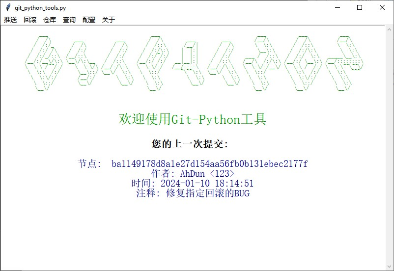

## git图形化python脚本工具

- 支持WINDOWS/LINUX/MAC 跨平台
- 创建新仓库自动生成.gitignore文件和readme.md文件
- 使用Tkinter GUI库编写,无需额外的库支持
- 开源协议LICENSE-2.0   (详情见源码)

在源码中,有以下的配置

`default_branch = 'master' #默认分支
touch_gitignore_file  = True #创建仓库时,自动新建.gitignore文件
touch_readme_file  = True #创建仓库时,自动新建readme文件`