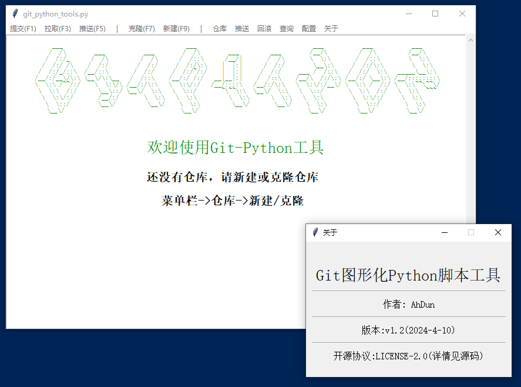

## Git图形化Python脚本工具





- 支持WINDOWS/LINUX/MAC 跨平台
- 创建新仓库自动生成.gitignore文件和readme.md文件
- 使用Tkinter GUI库编写,无需额外的库支持
- 开源协议LICENSE-2.0   (详情见源码)

### 配置

> 在源码中(30行),有以下的配置
>

 ```python
  - default_branch_dialog = False #分支输入窗口
  - default_branch = 'master' #默认分支
  - touch_readme_file  = True #创建仓库时,自动新建readme文件
  - python_copy_to_repository = True #克隆时自动复制脚本到仓库
 ```


### 支持

- #### 仓库
- 新建
- 克隆
- 拉取

- #### 推送
- 本地提交
- 仓库推送
- 撤回本地提交
- #### 回滚
- 上次提交
- 指定提交
- #### 查询
- 本地提交记录
- 历史提交记录
- 仓库地址
- 用户名和邮箱
- #### 配置
- 仓库地址
- 用户名和邮箱